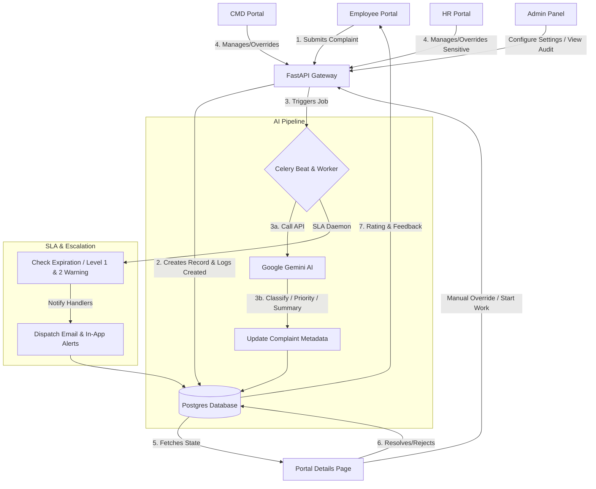

# 🛡️ AI Complaint Analyzer & Platform (AI-CMP)

[](https://fastapi.tiangolo.com)
[](https://nextjs.org)
[](https://www.postgresql.org)
[](https://docs.celeryq.dev)
[](https://www.docker.com)
[](https://deepmind.google/technologies/gemini/)

An enterprise-grade, production-ready **AI-Powered Employee Complaint Management System** designed to handle internal workplace complaints securely and transparently. Using Google Gemini for analysis and Celery for background processing, it automates classification, priority triage, SLA tracking, and audit logging while maintaining complete role-based segregation (CMD vs. sensitive HR cases) and permitting manual human overrides.

---

## 🗺️ Interactive System Architecture

The following diagram illustrates how a complaint flows through the system, from creation, AI analysis, manual overrides, and SLA escalation to resolution.



---

## ✨ Features & Capabilities

| Module | Features | Description |
| :--- | :--- | :--- |
| **🧠 AI Core** | Auto-Categorization | Identifies primary department and subcategory based on description. |
| | Priority Triage | Computes a priority score (0-100) and maps to LOW, MEDIUM, HIGH, or CRITICAL. |
| | Safety Filter | Scans and classifies cases with high-risk signals as **HR-Sensitive/Whistleblower** cases. |
| | Summary & Tags | Synthesizes descriptions into short issue titles and inserts search tags. |
| **🛠️ Handlers** | Human-in-the-Loop | CMD/HR can manually correct AI classification (department, priority, HR sensitivity). |
| | Assignment Queue | Handlers can assign complaints, start work, resolve (notes + root cause), or reject (reason). |
| | Internal Notes | Secure note-taking capability invisible to the employee for case logging. |
| **📋 Governance** | Compliance Audits | Logs every status change, category update, priority override, or assignment in `complaint_audit_logs`. |
| | Escalation Engine | Monitors SLA timings, warning handlers at 50% / 75% elapsed time, and triggering breach warnings. |
| | Security & RBAC | Granular role-based access control. Handlers cannot see identity in HR-sensitive whistleblower cases. |
| **🤝 Collaboration** | Team Management | Admins can create teams, manage members, and handle team-based complaints. |
| | Invitations | Secure email invitations to join specific roles and teams. |
| **🛡️ Security** | Cookie-Based Auth | Hardened security using httpOnly cookies for session management (no localStorage). |
| | Security Audit Guide | Comprehensive internal guide with vulnerabilities, role threats, and audit checklists. |

---

## 🔑 Demo Credentials & Accounts

| Role | Email | Password | Scope & Access |
| :--- | :--- | :--- | :--- |
| **Admin** | `admin@demo.com` | `Admin@1234` | System-wide analytics, user management, and global audit logs. |
| **CMD** | `cmd@demo.com` | `Cmd@1234` | Non-HR sensitive complaints in their respective department. |
| **HR** | `hr@demo.com` | `Hr@1234` | HR-sensitive & Whistleblower cases across all departments. |
| **Employee** | `employee@demo.com` | `Emp@1234` | Submitting complaints, tracking status, and rating resolutions. |
| **Handler** | `handler@demo.com` | `Hand@1234` | Handles escalated complaints and resolves tickets efficiently. |
| **Evaluator** | `evaluator@demo.com` | `Eval@1234` | Reviews and audits complaint resolutions for quality assurance. |

---

## ⚡ Quick Start (Local Docker Setup)

### 1. Pre-requisites
Make sure you have [Docker](https://www.docker.com/) and [Docker Compose](https://docs.docker.com/compose/) installed on your machine.

### 2. Configure Environment Variables
Create a `.env` file in the root directory (or copy from `.env.example`). Modify your Gemini API Key:
```env
GEMINI_API_KEY=your_actual_google_gemini_api_key_here
```

### 3. Spin Up Containers
Launch PostgreSQL, Redis, FastAPI backend, Celery worker, Celery beat, and the Next.js frontend:
```bash
docker-compose up --build -d
```

### 4. Run Migrations & Seed Data
Initialize the database tables and populate the default departments, users, and tenants:
```bash
# Apply database schemas
docker-compose exec backend alembic upgrade head

# Seed initial portal data
docker-compose exec backend python scripts/seed.py
```

### 5. Access the Platform
* **Next.js Frontend Portal:** [http://localhost:3000](http://localhost:3000)
* **FastAPI Swagger API Documentation:** [http://localhost:8000/docs](http://localhost:8000/docs)
* **Backend Health Check:** [http://localhost:8000/health](http://localhost:8000/health)

---

## 🔬 Running Integration & Automated Tests

To validate the entire lifecycle of the application locally, run the built-in python test script. It verifies user authentication, complaint submission, background AI processing, manual metadata overrides, audit log creation, handler resolution, and ratings.

```bash
# Install httpx dependency if needed
pip install httpx

# Run the E2E verification test
python scratch/verify.py
```

---

## 🏗️ Folder Directory Structure

```
ai-complaint-analyzer/
├── backend/
│   ├── app/
│   │   ├── api/v1/          # Endpoint controllers (auth, complaints, admin, notifications)
│   │   ├── core/            # Security (JWT, bcrypt), RBAC decorators, custom exception classes
│   │   ├── db/              # SQLAlchemy session local setup and model definitions
│   │   ├── schemas/         # Pydantic validation request/response payloads
│   │   ├── services/        # Domain business logic (complaints lifecycle, search, analytics)
│   │   ├── ai/              # Gemini API integrations and rule-based fallback heuristics
│   │   ├── workers/         # Celery task definitions (AI pipeline, SLA daemon, notifications)
│   │   └── storage/         # File attachment uploads manager
│   └── Dockerfile
├── frontend/
│   ├── app/                 # Next.js App Router Pages (employee, handler, admin portals)
│   ├── components/          # Glassmorphic UI layout elements, TopBars, Sidebars, Badges
│   ├── lib/                 # Axios API wrappers, authorization contexts, and charts helper
│   └── package.json
└── docker-compose.yml       # Dev orchestration configuration
```

---

## 🔒 Security & Data Compliance
1. **Password Hashing:** Implemented using `bcrypt` to secure stored credentials.
2. **Access Security:** Scoped JWT access and refresh tokens stored securely via httpOnly cookies, completely replacing localStorage for enhanced security.
3. **Sensitive Columns:** The system enforces complete anonymity for whistleblower complaints; normal department heads (CMD) cannot fetch the submitter's identity for files flagged as `is_hr_sensitive`.
4. **File Safety:** Attachment storage uses randomly generated UUID hashes for storage keys to prevent path traversal attacks.
